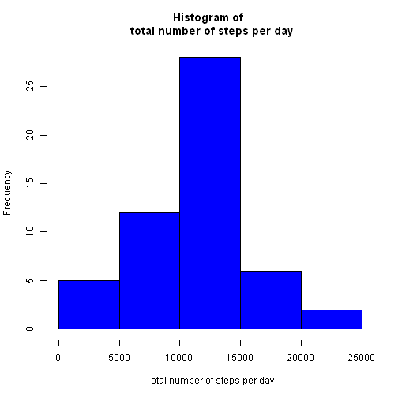
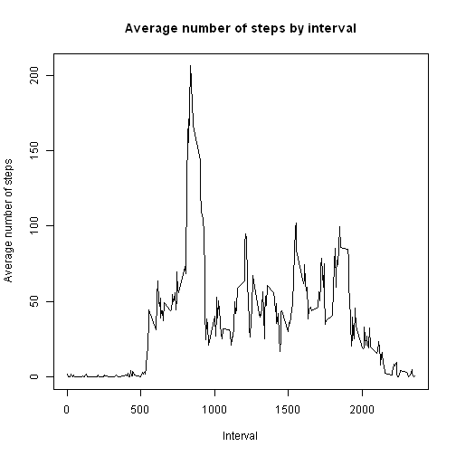
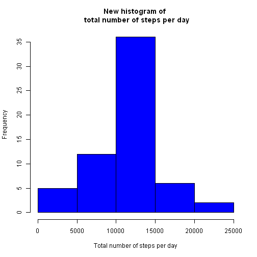
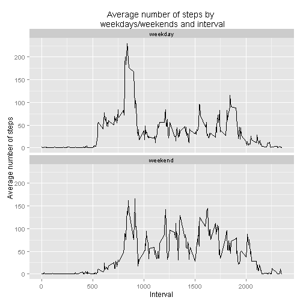

Programming assignment 1 for Reproducible Research
===

Loading and preprocessing the data
---

Below code shows reading in the data. I've changed also the class of `date` variable, which will be needed later.

```r
activity<-read.csv("activity.csv",stringsAsFactors=FALSE)
activity$date<-as.Date(activity$date)
```
What is mean total number of steps taken per day?
---
To calculate the total number of steps taken each day I used function aggregate.

```r
totalsteps<-aggregate(steps~date,data=activity,sum)
```
Below code shows and creates the histogram of total number of steps taken per day.

```r
hist(totalsteps$steps,col="blue",main="Histogram of \n total number of steps per day", xlab="Total number of steps per day")
```

 

The codes to calculate the mean and the median of total number of steps. I used as.integer because the value of mean printed in html file was hardly readable (as:1.076618910^{4}) and the rounding functions did not work.

```r
meantotalsteps<-as.integer(mean(totalsteps$steps))
mediantotalsteps<-median(totalsteps$steps)
```
**The mean of total number of steps taken per day is: 10766. The median of the total number of steps taken per day is: 10765.**

What is the average daily activity pattern?
---
The average number of steps taken (averaged accross all days) are calculated by aggregate function and time-series (line) plot shows the daily activity accross the 5 minutes interval.

```r
avgsteps<-aggregate(steps~interval,data=activity,mean)
plot(avgsteps$interval,avgsteps$steps,type="l",main="Average number of steps by interval",xlab="Interval",ylab="Average number of steps")
```

 

The code to find the 5 minute interval, which contains the maximum number of steps in average.

```r
maxstepsinterval<-avgsteps[which.max(avgsteps$steps),1]
```
**The interval which contains the maximum number of steps in average is: 835.**

Imputing missing values
---
The dataset contains missing values which were ignored in previous analysis and can have impact on calculations. After checking that the dataset contains missing values only in variable `steps`, the amount of missing values can be calculated as below:

```r
missingvalues<-sum(is.na(activity$steps))
```
**The total number of missing values in the dataset is: 2304.**

To fill in the missing values I decided to use the mean of the corresponding 5 minute interval. As there are whole days missing, I found more appropriate this approach compared to using mean or median of the day. For this I used dataset `avgsteps` already created in previous step and I merged it with the `activity` dataset on column `interval`, which creates a dataset with 4 columns (`date`,`interval` and 2 columns for `steps` /`steps.x` and `steps.y`/, one from `activity` dataset and one from the `avgsteps` dataset). As a next step using ifelse I created a new column `steps`, which is taking the value from `avgsteps` steps in case the value in `activity` is missing (is NA) and using the value from `activity` in the other case. Then I subsetted the dataset to leave only colums `steps`, `date`, `interval` (removing `steps.x` and `steps.y`), to get a dataset, which is equal to the original dataset but with the missing values filled in.

```r
newactivity<-merge(activity,avgsteps,by.x="interval",by.y="interval")
newactivity$steps<-ifelse(is.na(newactivity$steps.x),newactivity$steps.y,newactivity$steps.x)
newactivity<-newactivity[,c(5,3,1)]
```
The below code calculates the total steps taken per day from this new dataset and creates a histogram.

```r
newtotalsteps<-aggregate(steps~date,data=newactivity,sum)
hist(newtotalsteps$steps,col="blue",main="New histogram of \n total number of steps per day", xlab="Total number of steps per day")
```

 

Then a code to calculate the new mean and median of the total steps.I used as.integer because the value of mean and median printed in html file was hardly readable (as:1.076618910^{4}) and the rounding functions did not work.

```r
newmeantotalsteps<-as.integer(mean(newtotalsteps$steps))
newmediantotalsteps<-as.integer(median(newtotalsteps$steps))
```
**The new mean of total steps taken per day is: 10766 and the new median of total steps taken per day is: 10766.**

As in the first calculation I ignored missing values and as I used the mean values to input missing values for this calculation, the new mean is the same as the old mean. The median was close to the mean during the first calculation. During the second calculation the median has changed and now is equal to the mean. This may be caused by the significant amount of missing values which were filled by mean values.

Are there differences in activity patterns between weekdays and weekends?
---
For this part in addition to introducing factor variable for weekdays and weekends I've changed my local language setting to English to have the analysis reproducible in any country. Also in this part I used library dplyr for calculation and ggplot2 for plotting.

Below code shows the creation of new factor variable, the calculation of average steps taken, averaged accross all weekdays or weekends for each interval. And the plot shows the average daily activity on weekdays and weekends and we can see the difference in activity.

```r
Sys.setlocale("LC_TIME", "C")
```

```
## [1] "C"
```

```r
library(dplyr)
library(ggplot2)
newactivity$weekdayweekend<-as.factor(ifelse(weekdays(newactivity$date)%in%c("Saturday","Sunday"),"weekend","weekday"))
newavgsteps<-newactivity[,c(1,3,4)]%>%group_by(weekdayweekend,interval)%>%summarise_each(funs(mean))
ggplot(newavgsteps,aes(x=interval,y=steps))+geom_line()+facet_wrap(~weekdayweekend,ncol=1)+ggtitle("Average number of steps by \n weekdays/weekends and interval")+xlab("Interval")+ylab("Average number of steps")
```

 
